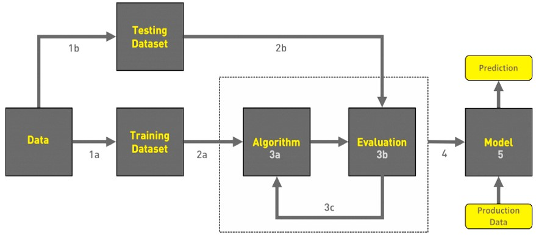
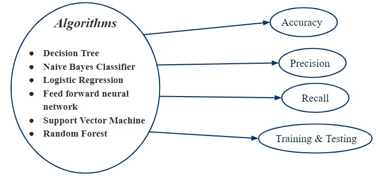
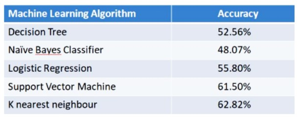

# Fire Detection Using Machine Learning Algorithms
𝗙𝗶𝗿𝗲 𝗗𝗲𝘁𝗲𝗰𝘁𝗶𝗼𝗻🔥using Machine Learning Algorithm with python🐍, GoogleColab & database taken from 𝗨𝗖𝗜 𝗠𝗮𝗰𝗵𝗶𝗻𝗲 𝗟𝗲𝗮𝗿𝗻𝗶𝗻𝗴 𝗥𝗲𝗽𝗼𝘀𝗶𝘁𝗼𝗿𝘆

### View Live Project on Google Colab:
https://colab.research.google.com/drive/1KLMoYmrs7GgP5UbU7FK-doUKopwVtXoT?usp=sharing

### Dataset from UCI Repository: 
https://archive.ics.uci.edu/ml/datasets/Forest+Fires

---
### Introduction
Fire in the forest can occur naturally or by humans. Naturally, fire takes place due to extreme drought, hot weather, lightning or combustion of dry leaves and scobs. Human activities like throwing cigarettes, especially in forest areas or using borne fire also lead to fires. 
  + So, fires which take place due to humans, are identified earlier than naturally occurring fires. There are various factors involved when a region catches fire. The hot and dry weather works as catalysts for fire. Since when there is fire in any region then the temperature of the region will become high due to fire. So increase in temperature is one of the factors which can help in fire detection events. 
  + But we cannot just depend on temperature to detect fire as the temperature of a region also may increase due to sunlight. So we can also check the concentration of CO, CO2 gases in that region to detect the fire. But CO, CO2 gases can also be generated when someone uses the cigarette in that region so it may give false alarm, i.e., false fire event detection. 
  + To increase the accuracy in predicting fire events, we will use various ML algorithms to check if there is fire or not. We will also train the machine and test by providing custom input whether there is fire or not. We will also calculate the accuracy, recall, and precision of these ML Algorithms. Hence we can save our environment ,animals and livelihood from the adverse results of forest fires.
---
### Project Requirement
```diff 
- HARDWARE
    Processor Above: 1.5Ghz
    Hardware Disk: 80GB
    RAM: 2GB

+ SOFTWARE
    OS: Windows 7,8, 10
    Language: Python
    IDE: Colab (by Google)
```
---
### Proposed Approach
Dataset is taken from **[UCI Machine Learning repository](https://archive.ics.uci.edu/ml/datasets/Forest+Fires)**, description of dataset is described as below:
+ Dataset contains image and video data.
+ Image data contains test and train data in image format each having 3 class i.e., default, smoke, fire.
+ Test_default has 84 images, test_fire has 57 images, test_smoke has 30 images.
+ Train_default has 161 images, train_fire has 274 images, train_smoke has 258 images.
+ Video data contains test and train data in video format.
+ Test_video contains 3 videos.
+ Train_video contains 12 videos consisting of fire with smoke, only fire, only smoke, no fire videos.
---
### Project Workflow
<br>
__-> Gathering data__<br>
__-> Data pre-processing__<br>
__-> Researching the model that will be best for the type of data__<br>
__-> Training and testing the model__<br>
__-> Evaluation__

---
### Implementation Analysis
<br><br>
Different algorithms are used to predict their Accuracy, Precision and Recall

---
### Experiment And Results
For this purpose, “Forest-fires.csv” dataset from UCI machine learning repository was taken and machine learning algorithms were applied to find accuracy of detection. The dataset **“Forest-fires.csv”** contains **517 instances** and **13 attributes**.
#####
<br>
#### Table: **[Correlation Coefficient](https://medium.com/analytics-vidhya/what-is-correlation-4fe0c6fbed47)** Analysis
Attributes | Correlation Coefficient
--- | ---
Day | -0.042970
RH | -0.035587
Rain | 0.025550
ISI | 0.035663
Wind | 0.055702
Y | 0.056892
X | 0.062491
DMC | 0.062672
FFMC | 0.073823
Temperature | 0.076047
DC | 0.096724
Month | 0.130329
Output | 1.000000
---
#### Thank You  !
---
